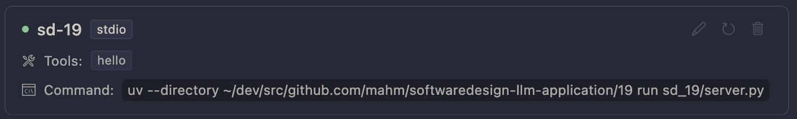

# Software Design誌「実践LLMアプリケーション開発」第19回サンプルコード

## サンプルコードの実行方法

### プロジェクトのセットアップ

※ このプロジェクトは`uv`を使用しています。`uv`のインストール方法については[こちら](https://github.com/astral-sh/uv)をご確認ください。

以下のコマンドを実行し、必要なライブラリのインストールを行って下さい。

```
$ uv sync
```

## 実行方法

以下のコマンドを実行することで、MCPサーバの動作確認を行うことができます。

```bash
uv run python -m sd_19.client
```

## MCPサーバの組み込み方

例えばCursorエディタに本サンプルコードの`sd_19/server.py`をMCPサーバとして組み込みたい場合、以下のように設定します。

| 項目 | 設定値 |
|------|--------|
| Name | sd-19 |
| Type | Command |
| Command | `uv --directory [プロジェクトのディレクトリパス]19 run sd_19/server.py` |

実際にCursorに設定した場合は、以下のように表示されます。（※ Cursor Settings > Features > MCP Servers）

