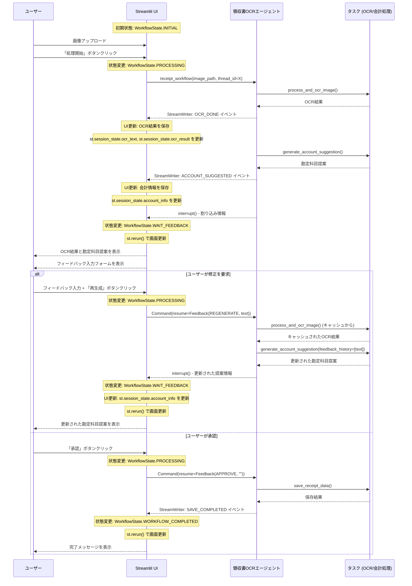

# Software Design誌「実践LLMアプリケーション開発」第22回サンプルコード

## サンプルコードの実行方法

### プロジェクトのセットアップ

※ このプロジェクトは`uv`を使用しています。`uv`のインストール方法については[こちら](https://github.com/astral-sh/uv)をご確認ください。

以下のコマンドを実行し、必要なライブラリのインストールを行って下さい。

```
$ uv sync
```

次に環境変数の設定を行います。まず`.env.sample`ファイルをコピーして`.env`ファイルを作成します。

```
$ cp .env.sample .env
$ vi .env # お好きなエディタで編集してください
```

`.env`ファイルを編集し、以下のAPIキーを設定してください。

- `ANTHROPIC_API_KEY`: Claude APIのキー

### 実行方法

```bash
uv run run.py
```

## Streamlitアプリとエージェントとの通信の全体像

Streamlitアプリとエージェントとの通信の全体像は次の図の通りです。コード理解の際にお役立てください。

