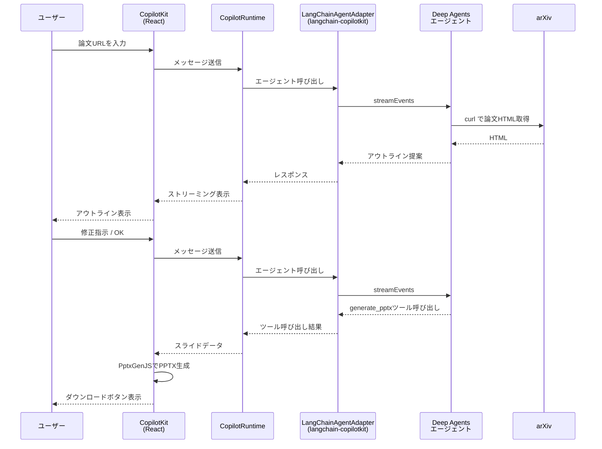

# Software Design誌「実践LLMアプリケーション開発」第32回サンプルコード

deepagentsjsとCopilotKitを活用した、arXiv論文からスライドを対話的に生成するエージェントアプリケーションです。

## サンプルコードの実行方法

### プロジェクトのセットアップ

このプロジェクトは`mise`と`bun`を使用しています。

```bash
mise install
mise run install
```

次に環境変数を設定します。

```bash
cp .env.sample .env
vi .env
```

`.env`ファイルを編集し、以下のAPIキーを設定してください。

```
ANTHROPIC_API_KEY=your_anthropic_api_key_here
LANGCHAIN_TRACING_V2=true
LANGCHAIN_API_KEY=your_langsmith_key_here
LANGSMITH_PROJECT=sd-32
```

- `ANTHROPIC_API_KEY`: Anthropic APIキー
- `LANGCHAIN_API_KEY`: LangSmith APIキー(オプション)

### Dockerでの実行(推奨)

```bash
mise run build
mise run up
```

ブラウザで http://localhost:3000 を開いてアプリを操作できます。

### ローカルでの実行

```bash
mise run dev
```

3000番以外のポートで起動したい場合は`PORT`環境変数を指定してください。

```bash
PORT=8080 mise run dev
```

> [!WARNING]
> サンプルアプリケーションで設定されている`LocalShellBackend`はホストマシン上で直接シェルコマンドを実行します。`virtualMode: true`により`workspace/`外へのアクセスは制限されますが、ホスト上で直接実行する場合、ワークスペース外のファイルが意図せず変更されるリスクがあります。**リスクが許容できない場合はDockerコンテナでの実行を推奨します。**

### Lint

```bash
bun run check
```

## 使い方

1. チャット欄にarXiv論文のURLを入力する(例: `https://arxiv.org/abs/XXXX.XXXXX`)
2. エージェントが論文を分析し、スライドのアウトラインを提案する
3. 対話を通じてアウトラインを調整する
4. 確定後、エージェントがPowerPointファイルを生成する
5. 左側のプレビューで内容を確認し、ダウンロードボタンからPPTXを取得する

HTML版が公開されていない論文(PDFのみ)は対象外です。

## ファイル構成

```
32/
├── agent/                          # エージェント
│   ├── index.ts                    # エクスポート
│   ├── agent.ts                    # createDeepAgent定義
│   ├── generate-pptx-tool.ts       # generate_pptxツール
│   └── system-prompt.ts            # システムプロンプト
├── app/                            # Next.js App Router
│   ├── layout.tsx                  # CopilotKitプロバイダー
│   ├── page.tsx                    # メインUI
│   ├── globals.css                 # グローバルスタイル
│   ├── api/copilotkit/
│   │   └── route.ts                # CopilotRuntimeエンドポイント
│   └── components/
│       ├── slide-preview.tsx       # スライドプレビュー
│       ├── slide-context.tsx       # スライドデータ共有Context
│       └── tool-call-renderer.tsx  # ツール実行UI・PPTX生成
├── workspace/                      # エージェントの作業ディレクトリ
│   ├── AGENTS.md                   # エージェント行動指針
│   └── .agent/skills/
│       └── pptx-generator/
│           └── SKILL.md            # PPTX生成スキル
├── Dockerfile                      # Dockerビルド設定
├── docker-compose.yml
├── .mise.toml                      # タスクランナー設定
└── .env.sample
```

## サンプルコードの処理フロー

サンプルコードの処理フローは、次のシーケンス図の通りです。[langchain-copilotkit](https://github.com/mahm/langchain-copilotkit/)がフロントエンドとバックエンド（エージェント）とのハブとなって動作します。


