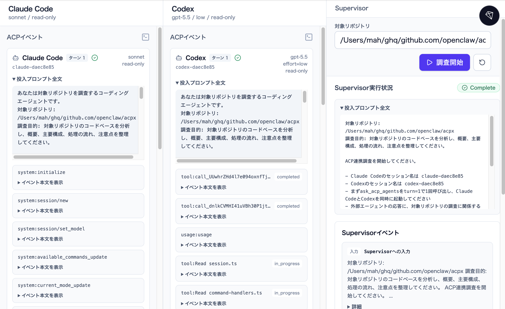
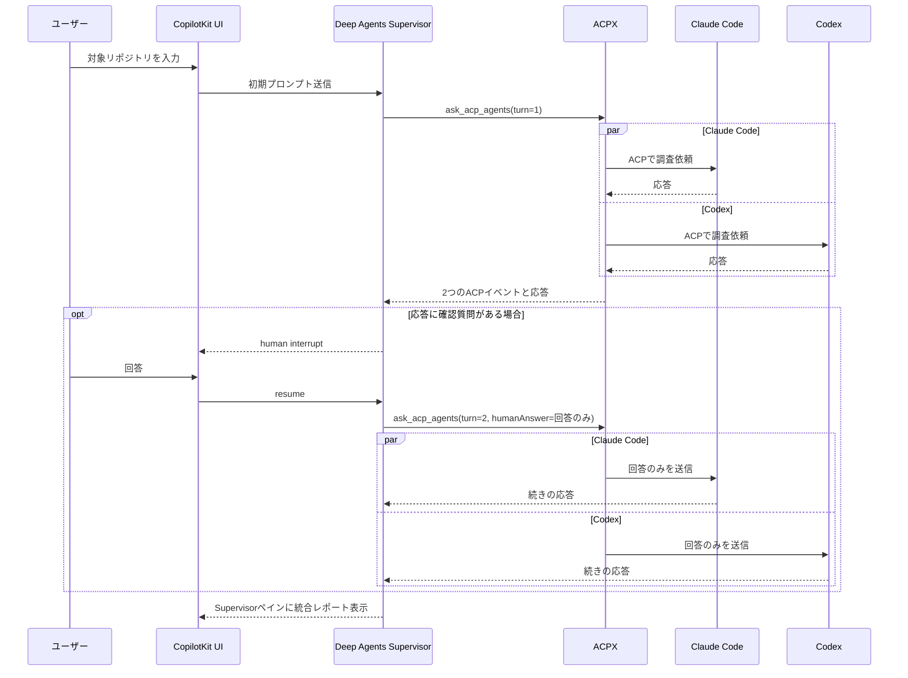

# Software Design誌「実践LLMアプリケーション開発」第34回サンプルコード

Deep AgentsによるSupervisorエージェントから、Agent Client Protocol（ACP）による通信でClaude CodeとCodexに同じリポジトリを調査させるデモです。エージェント間のACP通信には[ACPX](https://github.com/openclaw/acpx)を利用します。



## 前提条件

- [mise](https://mise.jdx.dev/)（ランタイムバージョン管理）
- Node.js 22以上
- Bun
- OpenAI APIキー
- `claude` コマンドが利用できるClaude Code環境
- `codex` コマンドが利用できるCodex環境

Claude CodeとCodexは、それぞれユーザー環境でログイン済みであることを前提にしています。このサンプルの`.env`にClaude Code用やCodex用のAPIキーを書く必要はありません。

外部エージェントは、ACPXの呼び出し時に次のオプションによる読み取り専用で動作するように設定されています。

```bash
--approve-reads --non-interactive-permissions deny --no-terminal
```

この指定により、読み取りや検索は許可し、それ以外の許可要求は非インタラクティブ実行では拒否されます。さらにACPのterminal capabilityを無効にし、外部エージェントがシェル実行を前提にしないようにします。

また利用モデルは、Codexの呼び出しでは`gpt-5.5/low`、Claude Codeの呼び出しでは`sonnet`が指定されます。

## セットアップ

```bash
# リポジトリルートで実行
mise trust 34/.mise.toml
cd 34
mise install
mise run install
```

次に環境変数を設定します。

```bash
cp .env.sample .env
vi .env
```

`.env`ファイルには、Supervisorが使うOpenAI APIキーを設定してください。

```env
OPENAI_API_KEY=your_openai_api_key_here
```

LangSmithを使う場合だけ、`LANGSMITH_API_KEY`なども設定します。

## 起動方法

```bash
mise run dev
```

ブラウザで http://localhost:3000 を開きます。別のポートで起動したい場合は、`PORT`を指定してください。

```bash
PORT=8080 mise run dev
```

## 使い方

1. Supervisorペイン本文の先頭にある「対象リポジトリ」に調査対象のパスを入力します。
2. 「調査開始」を押します。
3. SupervisorがClaude CodeとCodexをACPX経由で呼び出します。
4. 外部エージェントの応答に対象リポジトリの調査に関係する確認質問が含まれている場合だけ、Supervisorペインに回答フォームが表示されます。
5. 回答を送ると、Supervisorが同じACPXセッションへその回答だけを返します。
6. 追加の確認質問があれば同じ流れを繰り返し、十分な分析が揃ったらSupervisorが最終レポートをまとめます。

## 処理の流れ



## ファイル構成

```text
34/
├── agent/
│   ├── acpx.ts              # ACPX呼び出しツール
│   ├── agent.ts             # Deep Agents Supervisor
│   └── system-prompt.ts     # Supervisorの基本方針
├── app/
│   ├── api/copilotkit/      # CopilotKit Runtime
│   ├── components/          # 画面部品とinterrupt表示
│   └── page.tsx             # メイン画面
├── workspace/
│   ├── AGENTS.md            # Deep Agentsのメモリ
│   └── .agent/skills/       # ACP連携の手順
├── .mise.toml               # miseのランタイムとタスク設定
└── .env.sample
```

## 確認コマンド

```bash
bun run typecheck
bun run lint
```

## 参考リンク

- [openclaw/acpx](https://github.com/openclaw/acpx)
- [Agent Client Protocol](https://agentclientprotocol.com/)
- [CopilotKit](https://docs.copilotkit.ai/)
